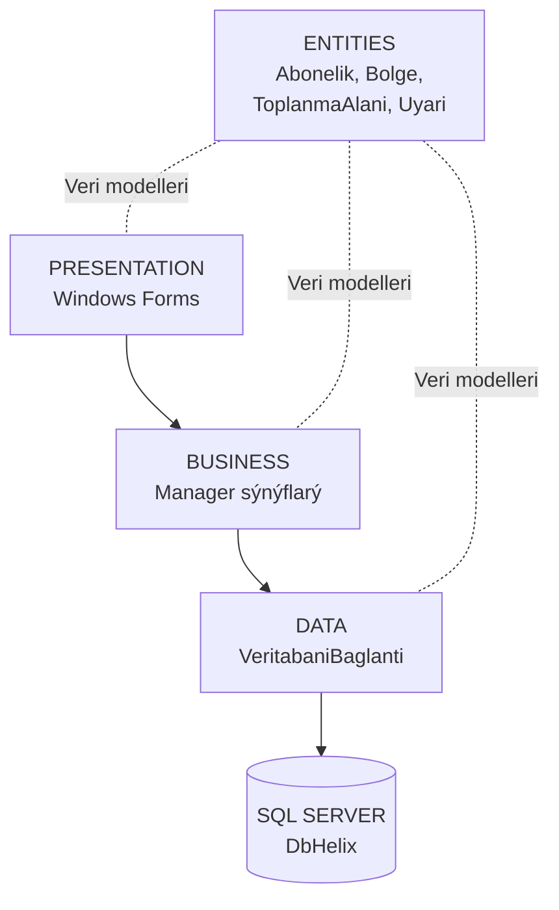

# Afet Erken Uyarý ve Bilgilendirme Sistemi
## Katmanlý Mimari Þemasý

```mermaid
flowchart TD
    A["PRESENTATION<br/>Windows Forms"] 
    B["BUSINESS<br/>Manager sýnýflarý"]
    C["DATA<br/>VeritabaniBaglanti"]
    D[("SQL SERVER<br/>DbHelix")]
    E["ENTITIES<br/>Abonelik, Bolge,<br/>ToplanmaAlani, Uyari"]

    A --> B
    B --> C
    C --> D

    E -. Veri modelleri .- A
    E -. Veri modelleri .- B
    E -. Veri modelleri .- C
```
